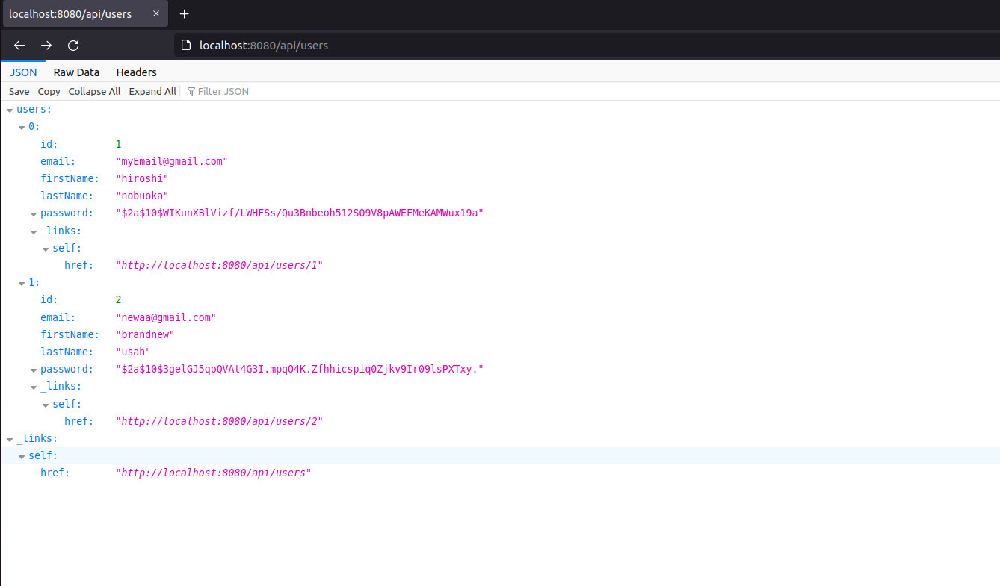

# Kaput: A Simple Web Interface for Tracking Job Applications
---

The app is named after the sound my car makes, which I'm hoping to replace once 
I no longer need to use such an app.  

Requirements:
- Java 11 or Newer
- PostgreSQL v14+ (will replace once Docker set up)

You will have to first create a database named `kaput` in PostgreSQL, then update the DB credentials 
in `build.gradle` (under the liquibase task) and `application.properties`.  

With the DB created and credentials updated, Liquibase should read `changelog-root.xml` to initialize the 
tables and data for you.

Run locally by executing the command `gradlew runBoot` from the project root directory. Once the app is up and 
running, go to `localhost:8080` from a browser.  

Only two entites are needed for this application.  

### Exception Handling
Exception handling is composed of two parts:
1. Providing a custom exception response body
2. Keeping the `RestControllerAdvice` class DRY by creating a `CustomException` class

The `CustomException` class is an abstract class that needs a `getStatusCode` method implemented. This 
allows for single "joinpoint" for a general group of exceptions, and not having to define one for each 
status code.  

One pain-point with this strategy is the inheritance tree is a bit long, where `Exception` -> `CustomException` -> 
`UserException` -> `UserNotFoundException`. I didn't know how to pass down every overloaded constructor from `Exception` 
down to the implemenation classes without having to define them in the intermediate classes, which feels very repetitve.  

### Validation
Both the data access and controller layers rely on the `javax.validation` annotations, but only the data access layer uses  
the validation constraints imposed by the `javax.persistence` annotations.

For example, a duplicate email POST request bypasses our exception handlers because it uses the `@Column` annotation to impose uniqueness.

Note that we override `handleMethodArgumentNotValid` in our `CustomResponseEntityExceptionHandler` because if we don't, the default 
implementation doesn't return a `ResponseEntity`, and so we don't get a response body.  

Another benefit of validating at the controller level is that the `Exception` object from `handleMethodArgumentNotValid` offers several 
convenience methods, which allow us to do things like return the default message for _each_ validation error to the API consumer.  

For PUT/PATCH methods, I tried using Map for User, then a DTO for JobApplication. The drawbacks of using a Map are
1. having to hardcode expected request body fields, while a DTO with `@Valid` could have inferred them  
2. writing your own validation logic
3. multiple places to refactor if the updateable fields change (e.g. where you perform the validation, **tests**,...)

While the drawbacks of using a DTO are 
1. you have to handle requests with invalid field-names (which you also have to do for Maps)
2. you have to create a custom method for updating an object using a DTO 

Also worth noting that handling deserialization errors requires us to override `handleHttpMessageNotReadable` method in our exception handler 
class. In general, it's a good idea to check that if an exception isn't getting caught by our handlers, check to see if there's a method 
we have to override that handles it already.

### Swagger Docs 
The Swagger UI can be accessed while the app is running from `http://localhost:8080/swagger-ui/index.html`. The Open API spec can be accessed 
from `http://localhost:8080/v3/api-docs`. Hoping to include [Slate](https://github.com/slatedocs/slate) eventually.  

### Content Negotiation
Added just two dependencies to allow XML-formatted responses. Get XML responses by providing the request header `Accept: application/xml` from  
`curl`/Postman/Talend.   

### HATEOAS
Most endpoints should respond as HAL + JSON media type, with links to relevant resources. Wasn't sure how to implement a proper representation 
model (i.e. HAL-compliant response body) for DELETE methods because JPA's `CrudRepository` API doesn't return the deleted resource.  

  

### Liquibase  
Took a minute to understand distinction between recording DB credentials via `spring.liquibase.*` in `application.properties` and as arguments for the liquibase Gradle plugin. The former can be used for bootstrapping your DB on application start, the latter is for running Gradle tasks like `generateChangeLog`. One pain point I could _not_ resolve is how the plugin resolves the path you give for the `changelogFile` parameter, as the same path seems to work some tasks but not for others.  

Worth noting that the insert `ChangeSet` didn't work until I removed the `tableName` parameter. Not sure why.  

### Hibernate & JPA
Biggest pain-point was debugging an `IllegalStateException` error from a one-to-many POST request. Enabling DEBUG logging didn't really help 
and I had to try different things before finding that if I set `CascadeType` to `PERSIST` Hibernate tries to insert a `JobApplication` with null fields. Instead, I have to set it to `MERGE`. Not sure why atm.  

Also, setting the `fetch` parameter to `LAZY` causes an exception to be thrown when making a GET request for a user's job applications.  

### Authentication  
Using Spring Security. Created a class that implements `UserDetailsService` so that my custom `User` class can be used for authentication. For 
future reference, **don't name your authenticator entity 'User', as it clashes with a User class defined in Spring Security**. Spring Security was somehow "smart enough" to know I want to connect to the PostgreSQL instance described in my `application.properties` file. Had I not specified `spring.datasource` properties, Spring Data would have created an in-memory storage for valid username/passwords by default.  

Since my passwords are encrypted with Bcrypt, I had to define a `PasswordEncoder` bean that returned a `BCryptPasswordEncoder` instance.  

