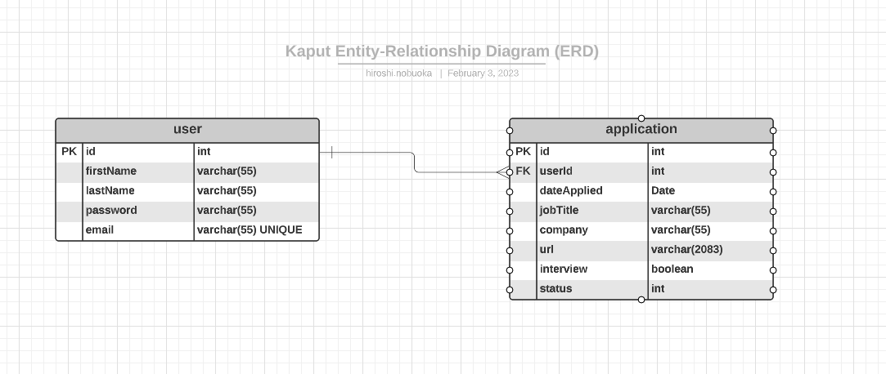

# Kaput: A Simple Web Interface for Tracking Job Applications
---

The app is named after the sound my car makes, which I'm hoping to replace once 
I no longer need to use such an app.  

Requirements:
- Java 11 or Newer
- PostgreSQL v14+ (will replace once Docker set up)

You will have to first create a database named `kaput` in PostgreSQL, then update the DB credentials 
in `build.gradle` (under the liquibase task) and `application.properties`.  

With the DB created and credentials updated, Liquibase should read `changelog-root.xml` to initialize the 
tables and data for you.

Run locally by executing the command `gradlew runBoot` from the project root directory. Once the app is up and 
running, go to `localhost:8080` from a browser.  

Only two entites are needed for this application.  
  

### Exception Handling
Exception handling is composed of two parts:
1. Providing a custom exception response body
2. Keeping the `RestControllerAdvice` class DRY by creating a `CustomException` class

The `CustomException` class is an abstract class that needs a `getStatusCode` method implemented. This 
allows for single "joinpoint" for a general group of exceptions, and not having to define one for each 
status code.  

One pain-point with this strategy is the inheritance tree is a bit long, where `Exception` -> `CustomException` -> 
`UserException` -> `UserNotFoundException`. I didn't know how to pass down every overloaded constructor from `Exception` 
down to the implemenation classes without having to define them in the intermediate classes, which feels very repetitve.  

### Validation
Both the data access and controller layers rely on the `javax.validation` annotations, but only the data access layer uses  
the validation constraints imposed by the `javax.persistence` annotations.

For example, a duplicate email POST request bypasses our exception handlers because it uses the `@Column` annotation to impose uniqueness.

Note that we override `handleMethodArgumentNotValid` in our `CustomResponseEntityExceptionHandler` because if we don't, the default 
implementation doesn't return a `ResponseEntity`, and so we don't get a response body.  

Another benefit of validating at the controller level is that the `Exception` object from `handleMethodArgumentNotValid` offers several 
convenience methods, which allow us to do things like return the default message for _each_ validation error to the API consumer.  

### Swagger Docs 
The Swagger UI can be accessed while the app is running from `http://localhost:8080/swagger-ui/index.html`. The Open API spec can be accessed 
from `http://localhost:8080/v3/api-docs`. Hoping to include [Slate](https://github.com/slatedocs/slate) eventually.  

### Content Negotiation
- XML Response Format  
Added just two dependencies to allow XML-formatted responses. Get XML responses by providing the request header `Accept: application/xml` from  
`curl`/Postman/Talend.   

### HATEOAS
Most endpoints should respond as HAL + JSON media type, with links to relevant resources. Wasn't sure how to implement a proper representation 
model (i.e. HAL-compliant response body) for DELETE methods because JPA's `CrudRepository` API doesn't return the deleted resource.  

